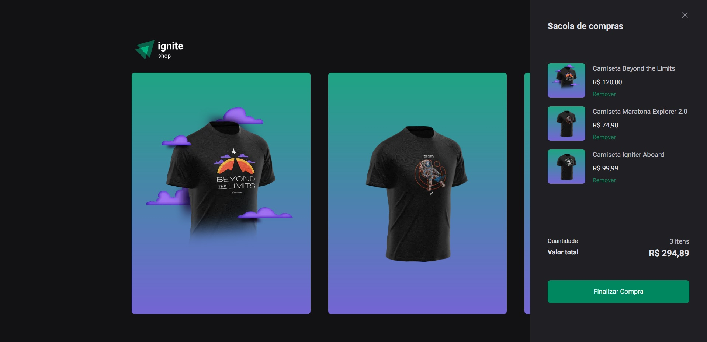

# Ignite Shop - Your favorite clothing 🎩

<br>

<p align="center">
  <a href="#-about-the-project">About the project</a> •
  <a href="#-technologies">Technologies</a> •
  <a href="#-getting-started">Getting started</a> •
  <a href="#-license">License</a>
</p>

<p align="center">
 
 
  
</p>

## 👩‍💻 About the project

This project, built with NextJS, offers a seamless online shopping experience for t-shirts. It utilizes the powerful payment processing capabilities of [STRIPE](https://stripe.com/), ensuring secure and convenient transactions for customers. Also contains a 2s delay so that you can view the skeleton screen.

To facilitate testing and demonstrate the payment functionality, the [STRIPE](https://stripe.com/docs/testing) documentation suggests using the following details: Card Number: 4242424242424242, any future date for expiration, and any CVC, email, or name.

[click here, see closer](https://ignite-shop-cs.vercel.app/) 😉

## 🔖 Layout

You can view the project layout through the links below:

- [Layout in Figma](<https://www.figma.com/file/5saYZc6GFjFTwElUNQFFqp/Ignite-Shop-2.0-(Copy)?node-id=0%3A1&t=GoswHJxAShzuHGnG-0>)

> Remembering that you need to have a [Figma](http://figma.com/) account to access it.

## 🚀 Technologies

- [NextJs](https://nextjs.org/)
- [Radix UI](https://www.radix-ui.com/)
- [Stitches](https://stitches.dev/)
- [Stripe](https://stripe.com/br)

## 💻 Getting started

### Requirements

- [Node.js](https://nodejs.org/en/)
- [Yarn](https://classic.yarnpkg.com/) or [NPM](https://www.npmjs.com/) _(examples are with yarn)_

**Clone the project and access the folder**

```bash

$ git clone https://github.com/leandrorodrigues00/ignite-shop && cd ignite-shop

```

**Follow the steps below**

```bash
# Install the dependencies
$ yarn

# Make a copy of '.env.example' to '.env'
# and set with YOUR environment variables.
$ cp .env.example .env

# Start the app
$ yarn dev
```

## 📝 License

This project is licensed under the MIT License - see the [LICENSE](LICENSE) file for details.

---

<p align="center">
  Made with 💜&nbsp; by  Leandro Rodrigues
</p>
